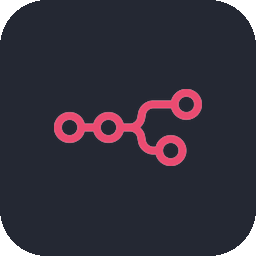

  

<h1 align="center">Hi, I'm Mateo Viotti</h1>

  <b>Information Systems Engineering Student - UTN</b> · Buenos Aires, Argentina 🇦🇷 
  Building <b>AI agents</b> and <b>automation</b> for real-world use cases.

  

---

### 🚀 About me

I've been learning about tech every day since I was 14, starting out self-taught in web development and gradually moving deeper into software and automation. Today, what I'm most passionate about is **applying AI agents and automation to real-world environments** that speed up processes and deliver measurable results.

- 🎓 Studying **Information Systems Engineering** at Universidad Tecnológica Nacional (UTN)
- 🤖 Focused on **AI agents, automation & systems integration**
- 🛠️ I like to understand how things work *under the hood* — from operating systems to production deployment
- 🌱 Currently exploring **AI applied to real business operations**
- 📫 Reach me at **mateo.viotti@gmail.com**

---

### 🧰 Tech Stack

**Languages**

  

**Tools & Platforms**

  
  

---

### 🔧 Featured Projects

**🤖 AI Chatbot + CRM for a Real Business**

Designed and implemented an end-to-end automation solution integrating AI into a business's daily operations. Built a WhatsApp chatbot (official API) to schedule classes and answer inquiries automatically, integrated a CRM, built automation workflows in n8n, and deployed the full infrastructure to production on a Linux VPS.
`WhatsApp API` · `n8n` · `CRM` · `Linux VPS` · `Automation`

  

  
  

**⚙️ Simplified Operating System**
Team project (6 people) written in C, implementing a simplified OS with a distributed architecture: independent modules communicating over TCP/IP sockets. Hands-on work with concurrency, process synchronization, semaphores, deadlock handling and scheduling.
`C` · `Concurrency` · `Distributed Systems` · `Sockets`

**🔤 Lexical & Syntactic Analyzer (Scanner + Parser)**
Team project in C implementing the first stages of a language translator — the scanner (lexical analysis) and parser (syntactic analysis) — to understand how a compiler processes source code, from raw characters to grammar validation.
`C` · `Compilers` · `Automata` · `Formal Languages`

---

  <i>Open to IT internship opportunities — always learning, always building.</i>

